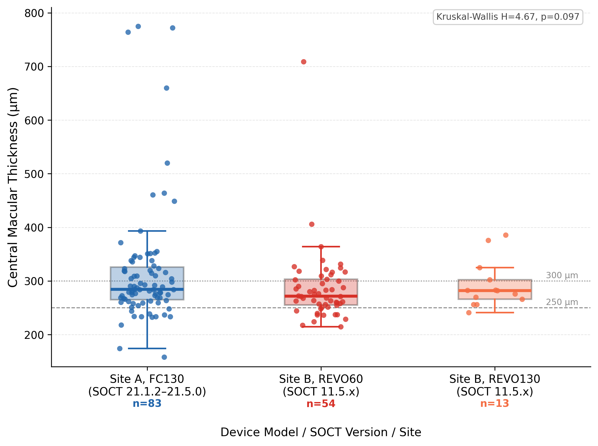

# Summary

Transducin is an open-source Python library that converts proprietary optical coherence tomography (OCT) data files into standards-compliant DICOM objects with machine-readable Structured Reports (SR). The library addresses two distinct interoperability gaps in clinical ophthalmic imaging: the entirely undocumented `.OPT` binary format used by the Optopol Revo FC130 family of OCT devices, and the vendor-specific private DICOM tags (coding scheme 99CZM) used by the Zeiss Cirrus HD-OCT to store quantitative measurements inaccessible to open systems.

For the Optopol platform, Transducin provides the first publicly documented specification of the `.OPT` chunk-container format, including novel findings from systematic binary reverse engineering: a laterality encoding embedded in the scan geometry (OCTPARAMS tag 23), a chunk-based discriminator for optic nerve versus macular acquisitions (DMARKERS), and cross-version compatibility across SOCT software versions 11.5.0 through 21.1.2. For the Cirrus platform, Transducin extracts quantitative measurements from private tags in the co-exported SpatialRegistration file and generates TID 1500 SRs without requiring format conversion.

All generated DICOM objects include SNOMED-CT coded findings with UCUM units, AnatomicRegionSequence encoding per DICOM SRT standards, calibrated PixelSpacing, and correctly populated acquisition timestamps. The library is deployed in active clinical production at a retinal specialty practice in Chihuahua, México, where it processes studies from a Revo FC130 and a Zeiss Cirrus HD-OCT 5000 in real time.

# Statement of Need

OCT is the cornerstone imaging modality in retinal practice, generating quantitative measurements — central macular thickness, ETDRS sectoral grids, peripapillary RNFL thickness, and optic disc cup-to-disc ratio — that are indispensable for longitudinal monitoring of retinal disease. Despite this clinical centrality, the majority of OCT devices either store their data in undocumented proprietary binary formats or export DICOM objects that omit coded quantitative measurements entirely.

The Optopol Revo FC130 and its family of nine related devices (SOCT software platform) represent a concrete example of the first failure mode: the `.OPT` format is entirely proprietary, with no published specification and no support in any existing open-source OCT parsing library, including OCT-Converter [@graham2021] or eyepy [@monks2023]. The manufacturer's own DICOM Conformance Statement (v21.1.2) explicitly confirms that no native export uses coded terminology (§7.3.5) and that no private DICOM attributes carry clinical data (§7.3.4). The Zeiss Cirrus HD-OCT represents the second failure mode: DICOM-compliant image export with quantitative measurements siloed in undocumented private tags.

Both failure modes prevent integration of OCT data into open PACS infrastructure, preclude construction of machine-readable longitudinal research databases, and create vendor dependency that disproportionately impacts practices in resource-limited settings where commercial integration solutions are economically inaccessible.

Transducin closes both gaps with a single Apache 2.0-licensed library, enabling any practice operating Revo FC130 or Cirrus HD-OCT equipment to integrate their quantitative OCT data into any DICOM-compliant PACS via standard C-STORE, with measurements queryable by SNOMED-CT code regardless of the source device.

# State of the Field

The open-source OCT ecosystem provides parsers for several major vendor formats. OCT-Converter [@graham2021] supports Heidelberg (`.e2e`, `.vol`), Zeiss (`.img`), Topcon (`.fda`, `.fds`), Optovue, and Bioptigen formats. eyepy [@monks2023] provides Heidelberg `.vol` parsing with layer segmentation. Neither library supports any Optopol format, and neither generates DICOM Structured Reports with SNOMED-CT coded findings from any device.

The highdicom library [@herrmann2022] provides TID 1500 SR generation via Python but contains no ophthalmic-specific extraction logic for any OCT device. Transducin extends the ecosystem by combining device-specific format parsing with standards-compliant SR generation — the first open-source implementation of this complete pipeline for either the Optopol or Zeiss Cirrus device families.

DICOM Supplement 247 (Eyecare Measurement Templates, DICOM 2025c) defines TIDs 6002–6008 for ophthalmic SR, but these templates are not yet implemented in highdicom. Transducin uses TID 1500 as a production bridge, with architecture designed for direct migration to Supplement 247 templates upon their availability in highdicom (PR #407).

# Functionality

Transducin provides two independent processing pipelines:

**Optopol Revo FC130 pipeline.** A hot-folder watcher service (Windows NSSM, `watchdog`) monitors the SOCT data directory for new `.OPT` files. On detection, the parser extracts B-scan volumes, SLO en-face images, segmentation layer boundaries, and biometric measurements from named zlib-compressed chunks. Acquisition type is classified via a deterministic chunk-presence hierarchy (ANGPRV → angio; DMARKERS → optic nerve; EYE + frame count → macular/HD line; FNDSRECO → wide-field; filename keyword fallback). Laterality is inferred from the arithmetic sign of OCTPARAMS tag 23 (foveal horizontal position in mm), validated at 100% accuracy across 18 files from two device models and three software versions. DICOM OphthalmicTomographyImageStorage objects and TID 1500 SRs are generated and delivered to Orthanc PACS via C-STORE.

**Zeiss Cirrus HD-OCT pipeline.** The pipeline identifies analysis files via the SpatialRegistration SOP Class co-exported with each study. Acquisition type is decoded from `PerformedProtocolCodeSequence` CodeValue (SD-MTA = macular, SD-GOUA = disc). Layer boundary dimensions are inferred dynamically from payload size (128×512 for macular; 200×200 for disc). CMT, ETDRS grids, RNFL sectors, and disc morphometry are extracted and encoded in TID 1500 SRs using the same SNOMED-CT codes as the Optopol pipeline.

**Validation.** The library was validated against 372 `.OPT` files spanning two clinical sites, three device models (Revo FC130, REVO60, REVO130), and four SOCT software versions (v11.5.0, v11.5.3, v21.1.2, v21.5.0): 284 site-A files (Chihuahua; FC130, SOCT v21.1.2 and v21.5.0) and 88 site-B files (Querétaro; REVO60 and REVO130, SOCT v11.5.x). Parse success was 100% across all 372 files. DICOM image generation (OphthalmicTomographyImageStorage multi-frame) succeeded for all 324 non-fundus acquisitions; Color Fundus previews stored in PREVIEW.DAT are not yet mapped to OphthalmicPhotography8Bit. SR TID 1500 generation with pydicom conformance validation (zero Type 1 attribute violations) succeeded in 228 of 372 files; the remaining 144 are acquisitions without extractable quantitative measurements in this dataset (angio, wide-field, ultra-wide, fundus, and OCT scans with insufficient signal quality for open-source layer segmentation). An independent retroactive batch of 11,956 historical studies processed overnight on the production system achieved 100% SR generation success. Of the 88 site-B files, 8 were standard macular cube acquisitions (REVO60, Querétaro); the remainder were optic nerve head scans, OCT-A companion volumes, wide-field sweeps, and biometry acquisitions correctly classified by the chunk-presence hierarchy. Quantitative central macular thickness agreement was assessed in 7 eyes that had concurrent native SOCT display values (5 site-B REVO60 + 2 site-A REVO FC130; one normal retina, one cystoid macular edema, five eyes with early-to-intermediate AMD or normal macular anatomy): mean bias +3.7 µm (Transducin − native), SD 18.2 µm, 95% limits of agreement −31.9 to +39.3 µm, ICC(2,1) = 0.995. Two scans were excluded from the primary agreement analysis due to systematic segmentation errors attributable to the open-source BOTTOM layer boundary rather than to the conversion pipeline: one eye with dry AMD and large drusen in which the segmentation algorithm tracked the outer RPE–drusen complex instead of the true Bruch's membrane (diagnostic dip = 17 µm, Δ = +76.6 µm), and one eye with subfoveal laser photocoagulation scars where post-laser sub-RPE fibrosis displaced the boundary inferiorly (Δ = +81.3 µm). These cases represent a known limitation of open-source retinal layer segmentation in advanced structural pathology; the proprietary SOCT segmentation corrects both anomalies. Including these two outliers shifts the bias to +20.4 µm (LoA −51.6 to +92.4 µm, n = 9), underscoring the importance of segmentation-quality gating prior to automated thickness transfer.

**Figure 1.** Distribution of central macular thickness (CMT) values extracted by Transducin across device models and SOCT software versions (Site A FC130 SOCT 21.1.2–21.5.0, n=83; Site B REVO60 SOCT 11.5.x, n=54; Site B REVO130 SOCT 11.5.x, n=13). Boxes show interquartile range; horizontal line = median; whiskers = 1.5×IQR; dots = individual acquisitions. High CMT values (≥400 µm) represent clinically valid cases with active retinal pathology. Kruskal-Wallis H=4.67, p=0.097.

# Acknowledgements

The authors thank the highdicom project (ImagingDataCommons) for the SR generation framework.

# References
